# Anajak Print -- Features & Flows

> ระบบ ERP สำหรับโรงงานสกรีนเสื้อ -- ทำลายข้อจำกัด Minimum Order ด้วยระบบจัดการที่ดีพอจะรับทุก Order ได้อย่างมีกำไร

> ⚠️ **สถานะไฟล์ (อัปเดต 2026-06-10):** ไฟล์นี้คือ **vision spec ดั้งเดิม** (เขียนก่อนเริ่ม build พ.ค. 2026) — เก็บไว้เป็น **reference** เรื่อง flow/โครงสร้างข้อมูล/ตาราง role · **แผน build จริงที่ยึด = `ROADMAP.md`** (P0-P4 + เหตุผล/ที่มา: `D:/dev/ai-agent2/records/projects/anajak-erp/plan.md`)
>
> **ส่วนที่ยังยึดตามไฟล์นี้:** โครงออเดอร์ 3 ชั้น (§1) · status flow + ตารางผู้รับผิดชอบ (§1) · RBAC 6 บทบาท (§7) · approval flow (§3) · portal (§9) · ทิศทางเชื่อม Anajak Stock (§10)
>
> **ส่วนที่ถูกแผนใหม่ทับ (superseded — อย่ายึดตามนี้):**
> - ~~Block reuse / BlockRef / block_fee (§1)~~ → โรงงานจริง DTF 70% + silkscreen outsource ทั้งหมด ไม่มีบล็อกในบ้าน — asset ที่ reuse คือ**ไฟล์พิมพ์** (คลังไฟล์+สั่งซ้ำ → P2/P3)
> - ~~Pricing Rule Engine สูตรกลางเต็มรูป (§1)~~ → ลดเป็น **ราคาที่ตกลงต่อลูกค้า + tier จาก ServiceCatalog** (P1) — full engine ค่อยว่ากันเมื่อมี job costing
> - ~~Capacity Planning + acceptance gate 3 มิติ (§1-2)~~ → ลดเป็น **ปฏิทินภาระงานเบา + เตือนเกินกำลังตอนรับงาน** (P1) ขนาดทีม 5 คน
> - ~~BOM เต็มรูปต่อ ProductTemplate (§1)~~ → ใช้ **film usage log + outsource AP → job costing** (P2) แทน — ต้นทุนจริงจากจุดเกิด ไม่ใช่สูตรล่วงหน้า
> - ~~Mockup Generator (§3)~~ → ตัด — ใช้รูปตัวจริง + ด่านตัวอย่างจริง (strike-off, P3) แก้ปัญหาเดียวกันถูกกว่า
> - ~~QR worker scan เต็มรูป (§1)~~ → เริ่มจาก QR ลิงก์บนใบสั่งงาน (job ticket, P1) + task queue มือถือ — scan-to-update รอพิสูจน์ความจำเป็น
> - ~~Anomaly detection (§7)~~ → เลื่อน later — P1 มีแค่ approval gate ส่วนลด/void + audit log
> - **ไฟล์นี้ไม่มีเรื่องภาษีเลย** — แผนใหม่เพิ่ม: ใบกำกับภาษีเต็มรูป ม.86/4 (ERP ออกเอง · เลขรันต่อเนื่อง · tax point ทุกงวดรับเงินรวมมัดจำ) + หัก ณ ที่จ่าย 2 ขา + ใบลดหนี้/เพิ่มหนี้ + ใบวางบิล/aging (P1)

---

## สารบัญ

1. [ภาพรวมระบบ](#ภาพรวมระบบ)
2. [Order Management -- การจัดการออเดอร์](#1-order-management--การจัดการออเดอร์)
3. [Production Management -- การจัดการผลิต](#2-production-management--การจัดการผลิต)
4. [Design & Revision Management -- จัดการงานออกแบบและแก้ไข](#3-design--revision-management--จัดการงานออกแบบและแก้ไข)
5. [Outsource Management -- จัดการงาน Outsource](#4-outsource-management--จัดการงาน-outsource)
6. [Billing & Invoice -- ระบบเปิดบิล](#5-billing--invoice--ระบบเปิดบิล)
7. [CRM -- Customer Relationship Management](#6-crm--customer-relationship-management)
8. [Fraud Prevention & Audit -- ป้องกันทุจริต](#7-fraud-prevention--audit--ป้องกันทุจริต)
9. [Analytics & Statistics -- ระบบสถิติ](#8-analytics--statistics--ระบบสถิติ)
10. [Customer Portal -- ส่วนของลูกค้า](#9-customer-portal--ส่วนของลูกค้า)
11. [Anajak Stock API Integration](#10-anajak-stock-api-integration)

---

## ภาพรวมระบบ

Anajak Print ประกอบด้วย 8 โมดูลหลัก + Customer Portal + Stock API Integration

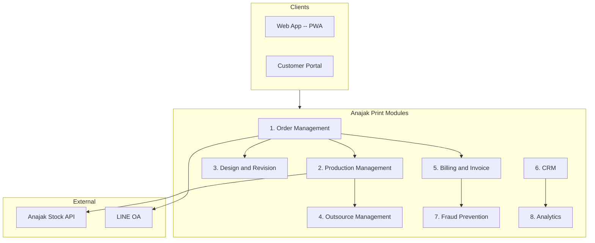


### Flow หลักทั้งระบบ (End-to-End)

```mermaid
graph LR
    A["ลูกค้าติดต่อ"] --> B["เปิด Inquiry"]
    B --> C["ทำใบเสนอราคา"]
    C --> D["ลูกค้าอนุมัติราคา"]
    D --> E["ออกแบบลาย"]
    E --> F["ลูกค้าอนุมัติแบบ"]
    F --> G["วางบิลมัดจำ"]
    G --> H["เข้าสู่การผลิต"]
    H --> I["QC ตรวจสอบ"]
    I --> J["แพคสินค้า"]
    J --> K["วางบิลส่วนที่เหลือ"]
    K --> L["จัดส่ง"]
    L --> M["เสร็จสิ้น"]
```


---

## 1. Order Management -- การจัดการออเดอร์

หัวใจหลักของระบบ -- รองรับตั้งแต่ 1 ตัว ไม่มีขั้นต่ำ

### Features

- **สร้างออเดอร์** -- รับรายละเอียดครบ: แบบเสื้อ, ไซส์, สี, จำนวน, วัสดุ, ตำแหน่งสกรีน, ประเภทสกรีน
- **Multi-item / Multi-variant** -- 1 ออเดอร์มีหลายแบบ แต่ละแบบมีหลายไซส์/หลายสีปนกันได้ในใบเดียว
- **Order Status Tracking** -- ติดตามสถานะแบบ real-time ตั้งแต่ Inquiry จนส่งมอบ
- **Revision Management** -- ลูกค้าแก้ไขได้ มี version history ทุกครั้งที่แก้ มี log ว่าใครแก้อะไร เมื่อไหร่
- **Deadline Tracking** -- กำหนดวันส่ง แจ้งเตือนอัตโนมัติเมื่อใกล้ครบกำหนด
- **แนบไฟล์** -- แนบ mockup/proof ให้ลูกค้าดูก่อนผลิต
- **Customer Approval** -- ลูกค้าอนุมัติแบบผ่าน portal/link ลดปัญหา "ไม่ได้สั่งแบบนี้"
- **Pricing Rule Engine** -- คิดราคาโปร่งใสตามสูตรกลาง ลูกค้าเห็น breakdown ทุกบาท ตรวจย้อนหลังได้
- **One-click Repeat Order** -- สั่งซ้ำลายเดิมในคลิกเดียว reuse บล็อกสกรีนเดิมไม่คิดเพิ่ม
- **QR Order Tracking** -- ทุกใบงานติด QR สแกนแล้วอัปเดตสถานะการผลิตได้ทันที

### Order Structure -- โครงสร้างข้อมูลออเดอร์

ออเดอร์ออกแบบเป็น 3 ชั้น เพื่อรองรับงานสกรีนที่ 1 ใบมักมีหลายแบบ และแต่ละแบบมีหลายไซส์/สีปนกัน

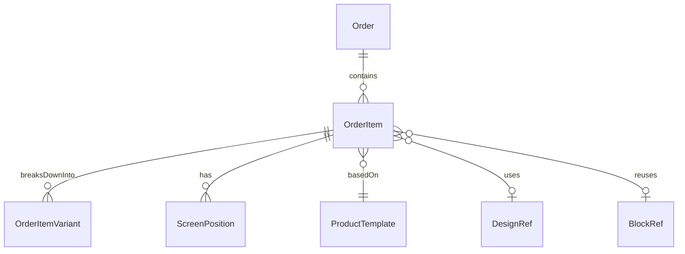

| ชั้น | ตัวอย่าง field หลัก | หมายเหตุ |
| --- | --- | --- |
| `Order` (header) | customer_id, deadline, payment_term, total, status, sales_owner | 1 ใบ = 1 deal |
| `OrderItem` (รายการ) | product_type, fabric, screen_positions[], colors_count, design_ref, block_ref, unit_price | 1 แบบ = 1 รายการ |
| `OrderItemVariant` (ตัวจริง) | size, color, qty | จำนวนจริงที่ผลิต |

ตัวอย่าง: ลูกค้าสั่ง "เสื้อโปโลสีดำ S 10 + M 20" และ "เสื้อยืดสีขาว L 50" ในใบเดียวกัน

```
Order #ORD-2604-0042
├── OrderItem #1: Polo, ผ้า TK, สกรีนหน้า 2 สี
│   ├── Variant: S, ดำ, 10
│   └── Variant: M, ดำ, 20
└── OrderItem #2: T-shirt, ผ้า Cotton 100%, สกรีนหลัง 1 สี
    └── Variant: L, ขาว, 50
```

### Order Status Flow

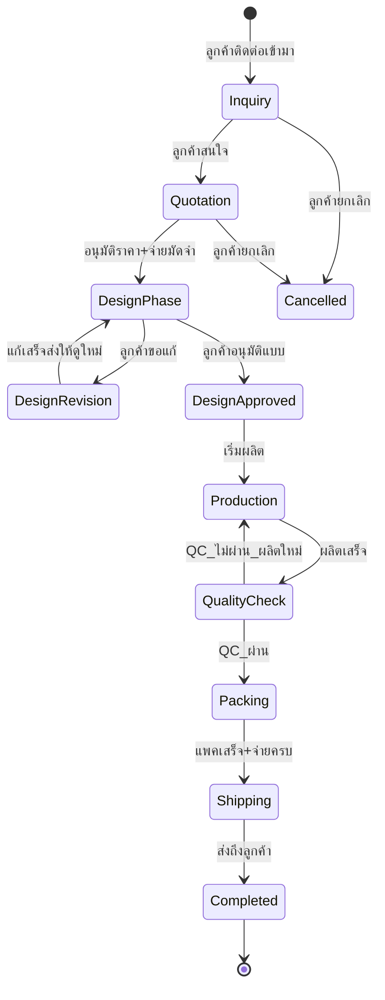


### สถานะออเดอร์ทั้งหมด


| สถานะ           | คำอธิบาย                             | ใครรับผิดชอบ |
| --------------- | ------------------------------------ | ------------ |
| Inquiry         | ลูกค้าติดต่อเข้ามา ยังไม่ได้เสนอราคา | ฝ่ายขาย      |
| Quotation       | ส่งใบเสนอราคาแล้ว รอลูกค้าตอบ        | ฝ่ายขาย      |
| Design Phase    | กำลังออกแบบลาย                       | ดีไซเนอร์    |
| Design Approved | ลูกค้าอนุมัติแบบแล้ว                 | -            |
| Production      | กำลังผลิต                            | ฝ่ายผลิต     |
| Quality Check   | ตรวจสอบคุณภาพ                        | QC           |
| Packing         | แพคสินค้า                            | ฝ่ายแพค      |
| Shipping        | จัดส่งแล้ว                           | ฝ่ายจัดส่ง   |
| Completed       | ส่งถึงลูกค้าแล้ว                     | -            |
| Cancelled       | ยกเลิก                               | -            |


### Pricing Engine -- เครื่องคิดราคา

ราคาสกรีนเสื้อมีหลายตัวแปร ระบบใช้สูตรกลางเพื่อให้ทุก quotation คำนวณเหมือนกันและตรวจสอบย้อนหลังได้

**สูตรหลัก (ต่อ OrderItem)**

```
unit_price   = base(product_type, fabric)
             + screen_cost(positions, colors_count)
             + extras(tag, special_pack, ...)
             - volume_discount(total_qty)

block_fee    = sum(positions) × block_unit_fee   -- ครั้งเดียวต่อลาย
             = 0 ถ้า reuse บล็อกเดิม

item_total   = unit_price × total_qty + block_fee
order_total  = sum(item_total) + setup_fee - order_discount
```

**ตาราง pricing rule ตัวอย่าง**

| ตัวแปร | ค่าตัวเลือก | ผลต่อราคา |
| --- | --- | --- |
| product_type | T-shirt / Polo / ถุงผ้า | base ตามประเภท |
| fabric | Cotton 100% / TK / TC | base ปรับ ±10-30% |
| colors_count | 1 / 2 / 3 / 4+ | +X บาท/สี/ตัว |
| screen_positions | หน้า / หลัง / แขน / กระเป๋า | +Y บาท/ตำแหน่ง |
| total_qty | 1-10 / 11-50 / 51-100 / 100+ | discount step 0% / 5% / 10% / 15% |
| block_fee | ต่อตำแหน่งสกรีน | ครั้งเดียวต่อลาย, reuse = 0 |

**Pricing Flow**

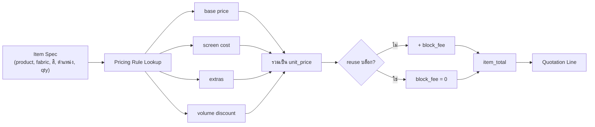

**ทำไม MOQ = 1 ยังมีกำไร?** เพราะระบบรู้ว่าจำนวนน้อย unit_price จะสูงตาม volume_discount step ลูกค้าเห็น breakdown เข้าใจที่มา ส่วนต้นทุนจริงดึงจาก BOM (subsection ถัดไป) เพื่อยืนยัน margin ก่อน confirm

### BOM Linkage -- เชื่อม Order กับวัสดุและสต๊อค

แต่ละ `ProductTemplate` มี BOM (Bill of Materials) ระบุว่าเสื้อ 1 ตัวใช้วัสดุอะไรบ้าง ระบบใช้ BOM × ราคาทุนจาก Anajak Stock เพื่อ

1. คำนวณ **ต้นทุนจริง** เทียบกับ unit_price ที่ตั้ง (ดู margin %)
2. **Pre-check** ตอน confirm ว่า stock พอผลิตหรือไม่
3. **เบิกอัตโนมัติ** ตอนเริ่มผลิตจริง

| Field ของ BOM | ตัวอย่าง |
| --- | --- |
| material_id | FAB-001 (ผ้า Cotton 100%) |
| qty_per_unit | 0.25 (กก. ต่อเสื้อ 1 ตัว) |
| unit | กก. / ม. / ใบ / ขวด |
| waste_factor | 1.05 (เผื่อเสีย 5%) |

**Order ↔ BOM ↔ Stock Sequence**

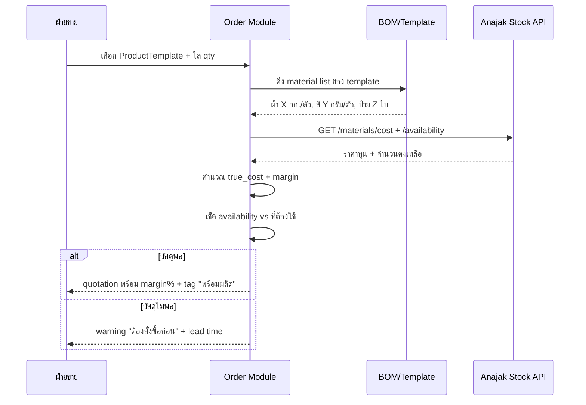

> หมายเหตุ: การ "เบิกจริง" ตอนเริ่มผลิตอยู่ใน [section 10 Anajak Stock API Integration](#10-anajak-stock-api-integration)

### Repeat Order & Block Reuse -- สั่งซ้ำและใช้บล็อกเดิม

ลูกค้าโรงงานสกรีน 60-70% เป็นขาประจำสั่งลายเดิม ฟีเจอร์นี้ลด lead time และลดต้นทุน เพราะไม่ต้องทำบล็อกใหม่

**Duplicate Order Flow**

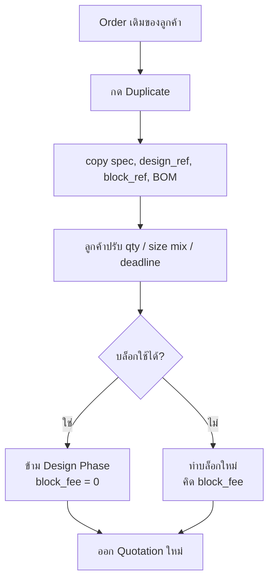

**เงื่อนไขที่ block reuse ได้** (ต้องผ่านครบทุกข้อ)

| เงื่อนไข | เกณฑ์ |
| --- | --- |
| อายุบล็อก | ≤ 12 เดือน นับจากใช้งานล่าสุด |
| สภาพบล็อก | QC ผ่าน (ไม่แตก ไม่หดตัว) |
| ความเหมือนของลาย | design_ref เดียวกัน หรือ revision เล็กน้อยที่ไม่กระทบ position/รูป |
| ตำแหน่งสกรีน | ตรงกับ position เดิม |
| ขนาดลาย | ตรงกับ block size เดิม |

ถ้าผ่านครบ -> reuse ได้ทันที, `block_fee = 0`, ออเดอร์ข้าม Design Phase ไปเริ่ม Production ได้เลย

### Order Tracking -- QR/Barcode บนใบงาน

ทุก OrderItem จะออก QR ไม่ซ้ำติดที่ tray การผลิต พนักงาน scan ด้วยมือถือเพื่อดู spec และอัปเดต step

**Order ID Format**

```
ORD-YYMM-XXXX        เช่น ORD-2604-0042
ORD-YYMM-XXXX-IT##   ระบุ item ในออเดอร์ เช่น ORD-2604-0042-IT01
```

| ส่วน | ความหมาย |
| --- | --- |
| `ORD` | prefix ออเดอร์ |
| `YYMM` | ปี-เดือนที่สร้าง (อ่านได้ในใบงาน) |
| `XXXX` | running ต่อเดือน reset ทุกเดือน |
| `IT##` | running item ในออเดอร์เดียวกัน |

**Worker Scan Flow**

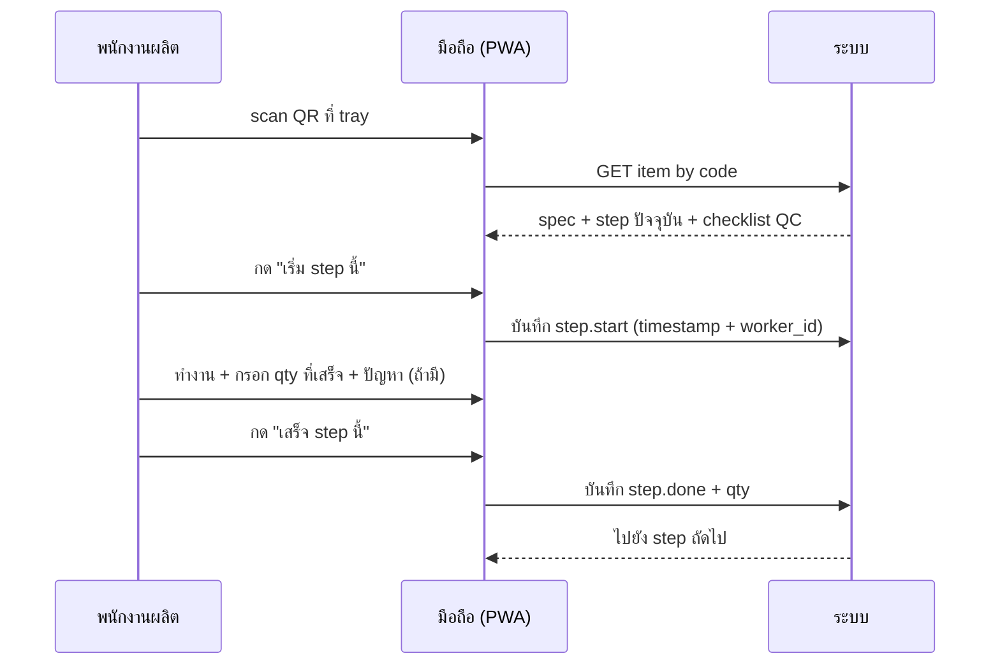

ข้อมูลที่ track อัตโนมัติ: เวลาที่ใช้จริงต่อ step, ผู้รับผิดชอบ, จำนวนเสีย -- ลิงก์กับ [section 2 Production Steps](#2-production-management--การจัดการผลิต)

### Acceptance & Confirmation -- กฎรับ/ปฏิเสธออเดอร์

ก่อน confirm Order ระบบเช็ค 3 มิติ ถ้าไม่ผ่านมิติใดมิติหนึ่งจะ warning ฝ่ายขายตัดสินใจรับ/ปรับ/ปฏิเสธ

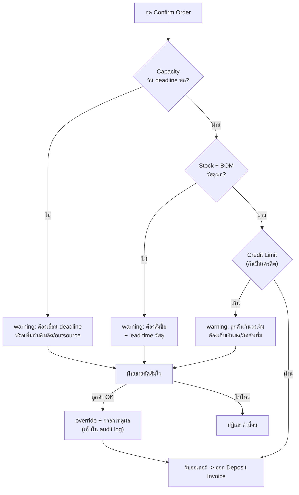

**Decision Matrix**

| มิติ | source ข้อมูล | เกณฑ์ผ่าน | ถ้าไม่ผ่าน |
| --- | --- | --- | --- |
| Capacity | Section 2 Production | qty ≤ slot ว่างก่อน deadline | เสนอ deadline ใหม่ / outsource |
| Stock | BOM × Anajak Stock | available ≥ required × waste_factor | สร้าง PR + แจ้ง lead time |
| Credit | CRM customer profile | (outstanding + order_total) ≤ credit_limit | ขอมัดจำเพิ่ม / จ่ายสด |

ทุกการ override จะถูกบันทึกพร้อมเหตุผลใน [section 7 Fraud Prevention & Audit](#7-fraud-prevention--audit--ป้องกันทุจริต) เพื่อ traceability

---

## 2. Production Management -- การจัดการผลิต

แยก production เป็น work steps ย่อย แต่ละ step track ได้อิสระ

### Features

- **Production Board** -- Kanban-style ดูภาพรวมงานทั้งหมด
- **Production Steps** -- แยกขั้นตอนย่อย assign คนทำ track เวลาจริง
- **Custom Step Templates** -- สร้าง template สำหรับงานแต่ละประเภท (เสื้อยืด, เสื้อโปโล, ถุงผ้า)
- **Capacity Planning** -- คำนวณว่าวันนี้รับงานได้อีกกี่ตัว
- **Cost Calculation** -- คำนวณต้นทุนจริงต่อชิ้น (วัสดุ + แรงงาน + overhead)
- **QC Checkpoint** -- จุดตรวจสอบคุณภาพที่ทุก step สำคัญ
- **เชื่อม Anajak Stock** -- เบิกวัสดุอัตโนมัติเมื่อเริ่มผลิต

### Production Steps (ขั้นตอนการผลิต)


| Step                       | รายละเอียด                            | หมายเหตุ             |
| -------------------------- | ------------------------------------- | -------------------- |
| Pattern Making (แพทเทิร์น) | สร้างแพทเทิร์น ตัดผ้า                 | สามารถ outsource ได้ |
| Screen Printing (สกรีน)    | เตรียมบล็อก ผสมสี สกรีน อบแห้ง        | งานหลักของโรงงาน     |
| Tagging (ป้ายแท็ก)         | เย็บป้ายแบรนด์ ป้ายไซส์ ป้ายดูแลรักษา | สามารถ outsource ได้ |
| Packaging (ถุงแพค)         | พับ ใส่ถุง ติดสติ๊กเกอร์              | -                    |
| Other (อื่นๆ)              | ปัก เย็บพิเศษ ฯลฯ                     | custom steps ได้     |


### Production Flow

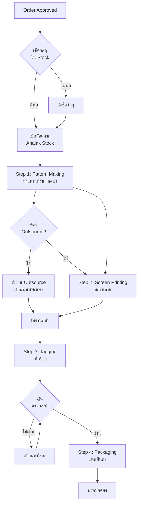


---

## 3. Design & Revision Management -- จัดการงานออกแบบและแก้ไข

Module สำคัญสำหรับรองรับ "ความเรื่องมากของลูกค้า"

### Features

- **Design File Management** -- เก็บไฟล์ต้นฉบับ (AI, PSD, PNG) ทุก version
- **Version Control** -- ทุกครั้งที่แก้ = version ใหม่ เปรียบเทียบ version ได้
- **Approval Workflow** -- ส่งแบบให้ลูกค้าอนุมัติผ่าน link (ไม่ต้อง login)
  - ลูกค้ากดอนุมัติ = มี digital signature + timestamp เป็นหลักฐาน
  - ลูกค้าขอแก้ = comment ได้บน mockup โดยตรง
- **Revision Tracking** -- บันทึกทุกการแก้ไข ใครขอแก้ แก้อะไร เมื่อไหร่
- **Revision Limit/Cost** -- ตั้งจำนวนแก้ฟรีได้ (เช่น 3 ครั้ง) เกินแล้วคิดเงินเพิ่ม
- **Mockup Generator** -- preview ลายบนเสื้อก่อนผลิตจริง
- **Asset Library** -- เก็บ logo, font, สีประจำแบรนด์ของลูกค้า ใช้ซ้ำได้

### Design Approval Flow

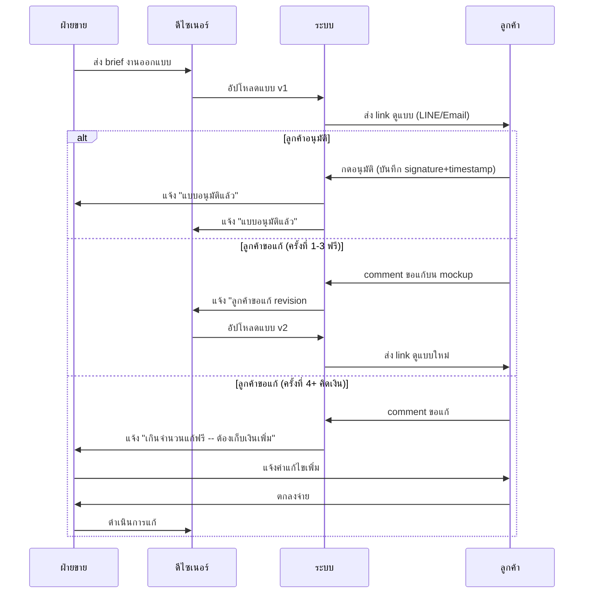


### Revision History ตัวอย่าง


| Version | วันที่     | ผู้ขอแก้ | รายละเอียด                | สถานะ       |
| ------- | ---------- | -------- | ------------------------- | ----------- |
| v1      | 12 ก.พ. 26 | -        | แบบแรกตาม brief           | ลูกค้าขอแก้ |
| v2      | 13 ก.พ. 26 | ลูกค้า   | เปลี่ยนสีโลโก้เป็นน้ำเงิน | ลูกค้าขอแก้ |
| v3      | 14 ก.พ. 26 | ลูกค้า   | ขยายโลโก้ใหญ่ขึ้น 20%     | อนุมัติ     |


---

## 4. Outsource Management -- จัดการงาน Outsource

รองรับงานที่ไม่มีเครื่องหรือคนทำ ส่งให้ vendor ภายนอก

### Features

- **Vendor Registry** -- ทะเบียน vendor ทุกเจ้า + ราคา + ความสามารถ + rating
- **Outsource Work Order** -- สร้างใบสั่งงาน outsource จาก production step ใดก็ได้
- **Status Tracking** -- track สถานะงาน outsource ตลอด
- **Cost Tracking** -- บันทึกต้นทุน outsource ต่อชิ้น
- **Quality History** -- บันทึกประวัติคุณภาพงานของแต่ละ vendor
- **Auto-suggest** -- แนะนำ vendor ที่เหมาะสมตาม type of work + ราคา + rating

### Outsource Flow

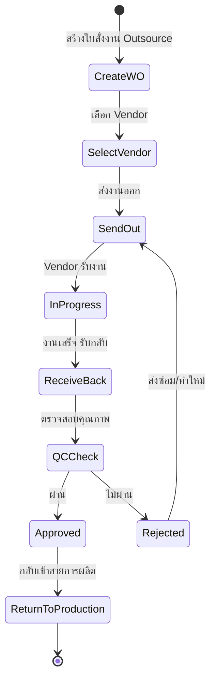


### Vendor Rating


| เกณฑ์       | คะแนน | คำอธิบาย             |
| ----------- | ----- | -------------------- |
| คุณภาพ      | 1-5   | QC ผ่านกี่ %         |
| ความตรงเวลา | 1-5   | ส่งทันตามกำหนดกี่ %  |
| ราคา        | 1-5   | เทียบกับ vendor อื่น |
| การสื่อสาร  | 1-5   | ตอบไว แก้ไขง่าย      |


---

## 5. Billing & Invoice -- ระบบเปิดบิล

### Features

- **Quotation (ใบเสนอราคา)** -- คำนวณต้นทุนอัตโนมัติจาก production steps + margin
- **Invoice (ใบแจ้งหนี้)** -- รองรับ deposit (มัดจำ) + แบ่งจ่ายหลายงวด
- **Receipt (ใบเสร็จรับเงิน)** -- ออกเมื่อรับเงินครบ
- **Payment Tracking** -- ติดตามสถานะ: จ่ายแล้ว / ค้างชำระ / เกินกำหนด
- **Payment Terms** -- ตั้งเงื่อนไขได้ (50/50, 30/70, จ่ายครบก่อนส่ง ฯลฯ)
- **Overdue Alert** -- แจ้งเตือนบิลค้างชำระอัตโนมัติ
- **Credit Note / Debit Note** -- กรณีแก้ไขราคาหลังออกบิล
- **Export PDF** -- ดาวน์โหลด/พิมพ์ได้

### Billing Flow

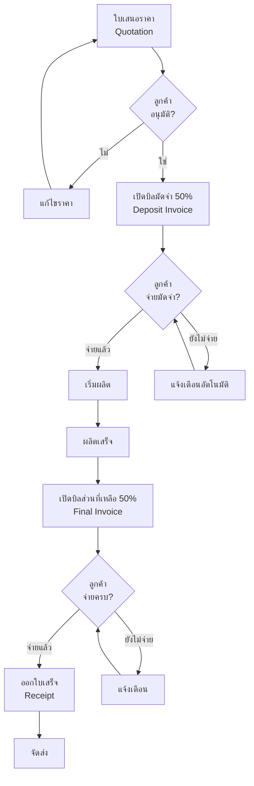


### เอกสารทางการเงิน


| เอกสาร                  | เมื่อไหร่              | หมายเหตุ                |
| ----------------------- | ---------------------- | ----------------------- |
| Quotation (QT)          | ลูกค้าสนใจ ต้องการราคา | แก้ไขได้จนกว่าจะอนุมัติ |
| Deposit Invoice (INV-D) | ลูกค้าอนุมัติราคา      | มัดจำก่อนเริ่มงาน       |
| Final Invoice (INV-F)   | ผลิตเสร็จ              | เก็บส่วนที่เหลือก่อนส่ง |
| Receipt (REC)           | รับเงินครบ             | หลักฐานการรับเงิน       |
| Credit Note (CN)        | ต้องลดราคา/คืนเงิน     | ต้องมี approval         |
| Debit Note (DN)         | ต้องเก็บเงินเพิ่ม      | เช่น ค่าแก้ไขเพิ่มเติม  |


---

## 6. CRM -- Customer Relationship Management

แก้ปัญหา "ไม่รู้ว่าลูกค้าเราคือใคร ต้องการอะไร"

### Features

- **Customer Profile** -- ข้อมูลครบ: ชื่อ, บริษัท, ที่อยู่, โทร, LINE, social media, ประเภทธุรกิจ
- **Brand Profile** -- เก็บข้อมูลแบรนด์ของลูกค้า: logo, สี, font, style ที่ชอบ
- **Order History** -- ประวัติสั่งซื้อทั้งหมด + สรุปยอดรวม
- **Communication Log** -- บันทึกทุกการสื่อสาร (LINE, โทร, อีเมล) ไม่มีหล่นหาย
- **Customer Tags/Segments** -- แบ่งกลุ่มลูกค้า (VIP, ขาประจำ, รายใหญ่, รายย่อย)
- **Customer Scoring (RFM)** -- ให้คะแนนอัตโนมัติตาม Recency / Frequency / Monetary
- **Follow-up Reminders** -- แจ้งเตือนติดตามลูกค้า เช่น "ลูกค้า A ไม่สั่งมา 3 เดือนแล้ว"
- **Preference Tracking** -- จดจำ preference ของลูกค้า (ชอบผ้าอะไร สีอะไร สไตล์ไหน)

### Customer Lifecycle Flow

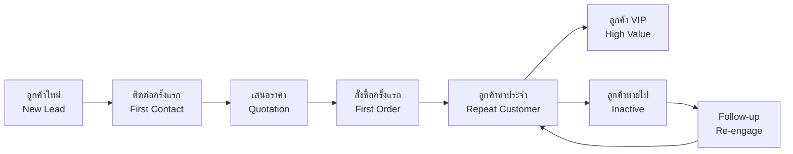


### RFM Scoring


| ระดับ | Recency (ล่าสุด)     | Frequency (ความถี่) | Monetary (ยอดเงิน) | ความหมาย  |
| ----- | -------------------- | ------------------- | ------------------ | --------- |
| 5     | สั่งภายใน 1 เดือน    | 10+ ครั้ง/ปี        | 100,000+ บาท/ปี    | Champion  |
| 4     | สั่งภายใน 3 เดือน    | 5-9 ครั้ง/ปี        | 50,000-99,999      | Loyal     |
| 3     | สั่งภายใน 6 เดือน    | 3-4 ครั้ง/ปี        | 20,000-49,999      | Potential |
| 2     | สั่งภายใน 12 เดือน   | 1-2 ครั้ง/ปี        | 5,000-19,999       | At Risk   |
| 1     | ไม่สั่งเกิน 12 เดือน | 0 ครั้ง             | < 5,000            | Lost      |


---

## 7. Fraud Prevention & Audit -- ป้องกันทุจริต

ป้องกันการทุจริตของพนักงาน โดยเฉพาะเรื่องการเงิน

### Features

#### Audit Trail (บันทึกทุก action)

- ทุก action ในระบบถูกบันทึก: ใคร ทำอะไร เมื่อไหร่ ค่าเก่า/ค่าใหม่
- บิลที่ออกแล้ว void ได้แต่ลบไม่ได้ (immutable records)
- ทุกการแก้ไขข้อมูลสำคัญ ต้องกรอกเหตุผลบังคับ
- บันทึก login/logout ทุกครั้ง + IP address

#### Role-Based Access Control (RBAC)


| Role             | เห็นอะไร                   | ทำอะไรได้                         |
| ---------------- | -------------------------- | --------------------------------- |
| Owner            | ทุกอย่าง                   | ทุกอย่าง + อนุมัติ + ดู audit log |
| Manager          | Production + รายงานการเงิน | จัดการ production + อนุมัติส่วนลด |
| Accountant       | Billing + การเงิน          | เปิดบิล (แก้ไขต้องได้รับอนุมัติ)  |
| Production Staff | เฉพาะงานที่ assign         | อัปเดตสถานะงานที่รับผิดชอบ        |
| Designer         | เฉพาะงานออกแบบ             | อัปโหลดแบบ + จัดการ design files  |
| Sales            | ลูกค้า + ออเดอร์           | สร้างออเดอร์ + เสนอราคา           |


#### Financial Approval Workflow

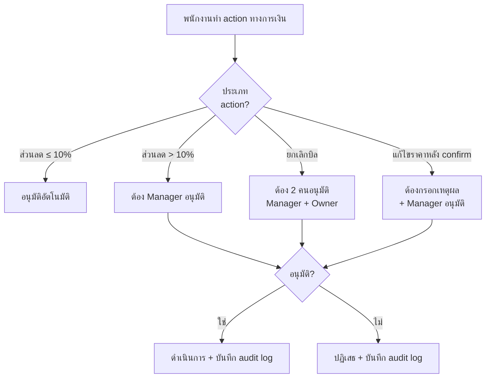


#### Anomaly Detection Alerts (แจ้งเตือนความผิดปกติ)


| เหตุการณ์           | เงื่อนไข                             | แจ้งเตือนใคร   |
| ------------------- | ------------------------------------ | -------------- |
| ส่วนลดผิดปกติ       | ส่วนลดเกิน X% ที่ตั้งไว้             | Owner, Manager |
| ยกเลิกบิลบ่อย       | ยกเลิก > 3 บิล/สัปดาห์ โดยคนเดียวกัน | Owner          |
| แก้ไขราคาบ่อย       | แก้ราคา > 5 ครั้ง/สัปดาห์            | Owner, Manager |
| วัสดุสิ้นเปลืองเกิน | ใช้วัสดุเกินค่าเฉลี่ย 30%            | Manager        |
| Login ผิดปกติ       | Login จาก IP ใหม่ / เวลาผิดปกติ      | Owner          |


---

## 8. Analytics & Statistics -- ระบบสถิติ

### Dashboards

#### Sales Dashboard

- ยอดขายรวม / ยอดเดือนนี้ / เทียบเดือนก่อน / แนวโน้ม
- รายได้ต่อประเภทงาน (เสื้อยืด, โปโล, ถุงผ้า)
- Average Order Value
- Conversion Rate (Inquiry -> Order)

#### Customer Dashboard

- ลูกค้าใหม่ vs ลูกค้าเก่า
- Top 10 ลูกค้า (ยอดสั่งสูงสุด)
- RFM Analysis
- Customer Retention Rate
- ลูกค้าที่หายไป (ต้อง follow-up)

#### Production Dashboard

- งานค้างรอผลิต / กำลังผลิต / เสร็จแล้ว
- Utilization Rate (กำลังการผลิตที่ใช้ vs ทั้งหมด)
- Lead Time เฉลี่ย (สั่งจนส่ง)
- QC Pass Rate
- Outsource Ratio

#### Financial Dashboard

- รายรับ-รายจ่าย / กำไรขั้นต้น
- บิลค้างชำระ + aging report
- Cash Flow รายเดือน
- ต้นทุนจริง vs ราคาขาย (margin %)

#### Outsource Dashboard

- ต้นทุน outsource รวม / ต่อ vendor
- Vendor Performance Ranking
- สัดส่วนงาน in-house vs outsource

### Reports (Export PDF / Excel)


| รายงาน           | รายละเอียด                                       |
| ---------------- | ------------------------------------------------ |
| รายงานลูกค้า     | ใครสั่งบ่อย, ใครสั่งเยอะ, ใครหายไป, ลูกค้าใหม่   |
| รายงานสินค้า     | ประเภทงานขายดี, ไซส์นิยม, สีนิยม                 |
| รายงานผลิต       | ต้นทุนจริง vs ราคาขาย, production efficiency     |
| รายงานการเงิน    | Profit margin, outstanding payments, monthly P&L |
| รายงาน Outsource | ต้นทุน, คุณภาพ, ความตรงเวลาของแต่ละ vendor       |


---

## 9. Customer Portal -- ส่วนของลูกค้า

Portal แยกให้ลูกค้า login เข้ามาดูสถานะเอง ลด workload ฝ่ายขาย

### Features

- **ดูสถานะออเดอร์** -- real-time ไม่ต้องทัก LINE ถาม
- **อนุมัติ/ขอแก้แบบ** -- ดู mockup + comment + กดอนุมัติได้เลย
- **ดูเอกสาร** -- ดาวน์โหลด Quotation, Invoice, Receipt เป็น PDF
- **ดูประวัติออเดอร์** -- ออเดอร์ทั้งหมดที่เคยสั่ง
- **แจ้งเตือน LINE OA** -- แจ้งเมื่อแบบเสร็จ/ผลิตเสร็จ/ส่งแล้ว

### Customer Portal Flow

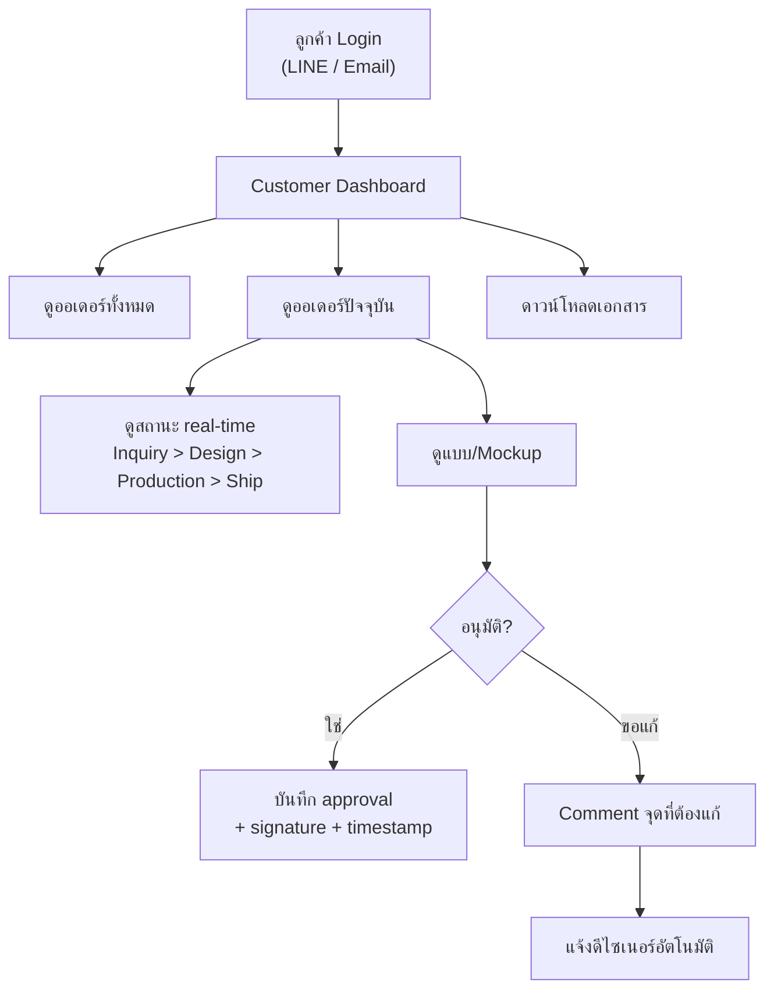


---

## 10. Anajak Stock API Integration

เชื่อมระบบสต๊อคกับ Anajak Stock ผ่าน API

### Integration Points


| จุดเชื่อมต่อ          | ทิศทาง         | เมื่อไหร่                               |
| --------------------- | -------------- | --------------------------------------- |
| ดึงรายการวัสดุ        | Stock -> Print | เมื่อสร้างออเดอร์ (เช็คว่ามีวัสดุพอไหม) |
| เบิกวัสดุ             | Print -> Stock | เมื่อเริ่มผลิต (หักสต๊อคอัตโนมัติ)      |
| แจ้งเตือนวัสดุใกล้หมด | Stock -> Print | เมื่อต่ำกว่า minimum                    |
| คำนวณต้นทุนวัสดุ      | Stock -> Print | ดึงราคาทุนจาก Stock มาคำนวณ             |
| เพิ่มสินค้าสำเร็จรูป  | Print -> Stock | เมื่อผลิตเสร็จ sync กลับ Stock          |


### Integration Flow

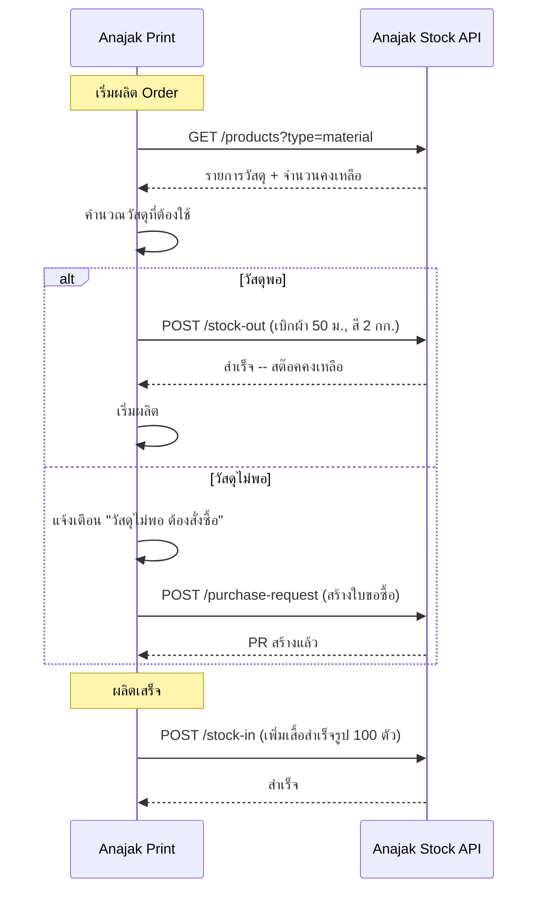


---

## สรุปความเชื่อมโยงทั้งระบบ

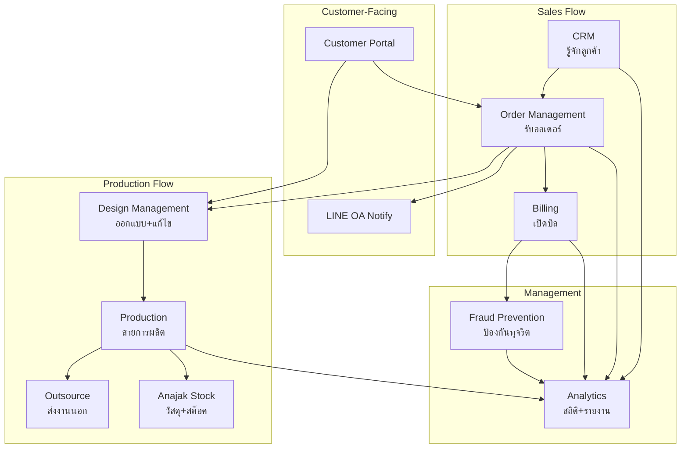


